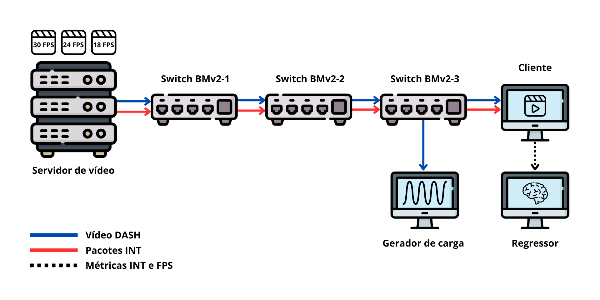

# Repositório [overhead-telemetry-int]
Este repositório tem por objetivo apresentar a equipe e compartilhar os códigos utilizados no experimento descrito no trabalho submetido no SBRC (2025), cujo o título é "**Explorando o overhead de telemetria em redes programáveis na estimativa de QoS com aprendizado de máquina**"

# Indice
1. [Introdução](#1-introdução)
2. [Execução dos códigos](#2-execução-dos-códigos)
    - 2.1. [run.sh](#21-runsh)
    - 2.2. [send.sh](#22-sendpy)
    - 2.3. [receive.sh](#23-receivepy)

---

## 1. Introdução
Sob coordenação do prof. Dr. Leandro Almeida, o projeto tem como objetivo compreender o overhead da telemetria em redes programáveis para estimar o QoS (Qualidade de Serviço) em transmissões de vídeo.

Esta pesquisa contou com o apoio do programa de fomento à pesquisa "**Interconecta**", do Instituto Federal da Paraíba (IFPB).

O desenvolvimento do projeto foi realizado por pesquisadores do Laboratório de Redes Inteligentes (LARIN) do IFPB e do Laboratório de Estudos em Redes, Inovação e Software (LERIS) da UFSCar.

A equipe responsável por este trabalho é composta por:
- **Prof. Dr. Leandro Almeida**, IFPB, ([orcid](https://orcid.org/0000-0003-4342-3030))
- **Prof. Dr. Fábio L. Verdi**, UFSCar, ([orcid](https://orcid.org/0000-0002-5455-8910))
- **Prof. Msc. Pedro Filho**, IFPB, ([orcid](https://orcid.org/0009-0000-5120-4052))
- **Rebeca Dantas**, aluna, IFPB, ([orcid](https://orcid.org/0009-0002-4820-892X))
- **Gabriel Santos**, aluno, IFPB, ([orcid](https://orcid.org/https://orcid.org/0009-0001-5639-5959))
- **Luis Kilmer**, aluno, IFPB, ([orcid](https://orcid.org/0009-0004-6164-0578))

## 2. Execução dos códigos
 
As avaliacões experimentais foram conduzidas em um ambiente virtualizado, utilizando um servidor Dell EMC PowerEdge equipado com 2 processadores Intel Xeon® E5-2609 0 @ 2.40GHz (8 vCPUs), 32 GB de RAM e 1 TB de HDD, operando com o sistema Debian GNU/Linux 11 (bullseye). A infraestrutura foi provisionada por meio das ferramentas VirtualBox (6.1.8), Vagrant (2.2.13) e Ansible (2.9.15).

Tomando como base a figura acima, a seguir é apresentado os principais scripts e como utilizá-los.

### 2.1 run.sh
O script run.sh automatiza a execução dos scripts send.py e receive.py, garantindo a sincronização entre as tarefas. Ele é executado no host local e dispara os comandos necessários em cada máquina virtual.

1. Inicia o receive.py no host "**Cliente**" para capturar pacotes INT.
2. Executa o send.py no host "**Servidor de Vídeos**" para enviar pacotes ao host "**Cliente**".
3. Reproduz o vídeo DASH no host "**Cliente**" com o VLC.
4. Gera tráfego adicional no host "**Gerador de carga**" com o sinusoid.py.

### 2.2 send.py
O script **send.py** é responsável por enviar pacotes INT do host "**Servidor de Vídeos**" para o host "**Cliente**", simulando tráfego de rede com metadados de telemetria gerados pelos switches programáveis.

Inicialmente, gera pacotes com metadados INT, configurados no código P4 dos switches. Os pacotes são enviados para o host "**Cliente**" em intervalos que podem ser ajustados diretamente no código.

### 2.3 receive.py
O script **receive.py** captura, processa e armazena os pacotes INT recebidos no host "**Cliente**", extraindo informações importantes para análise.

Após o recebimento dos pacotes INT enviados pelo host "**Servidor de Vídeos**", os pacotes são processados para obter o cabeçalho do pacote juntamente com seus respectivos valores. Esses dados são salvos para posterior análise.

